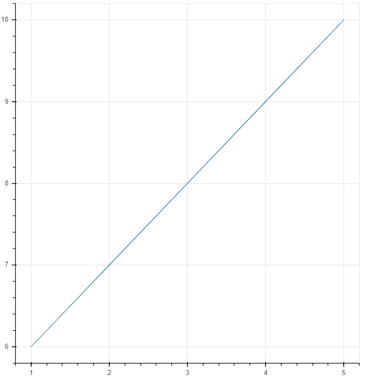
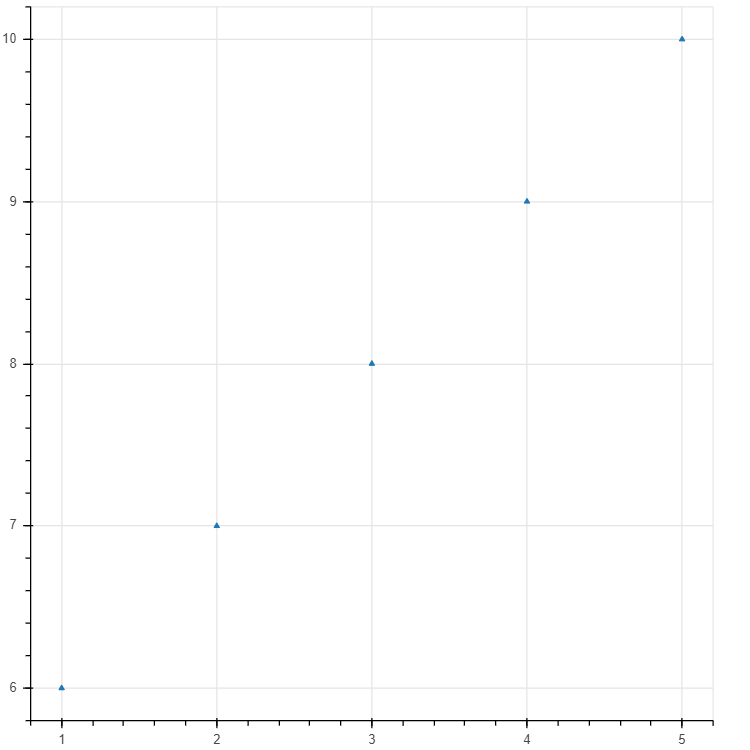
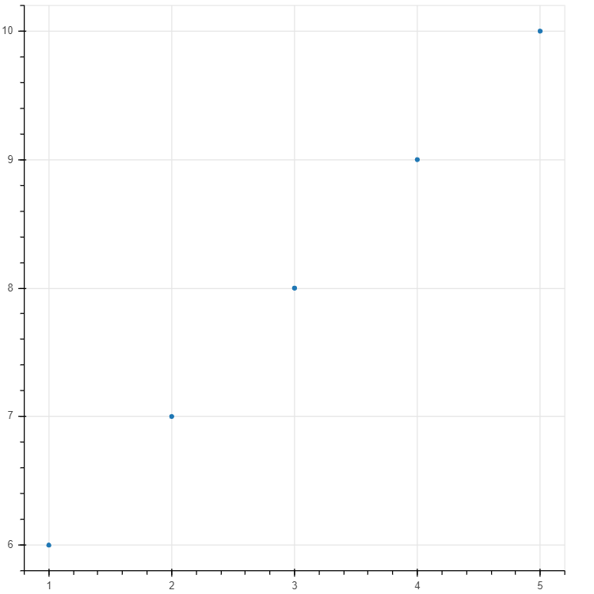

# Bokeh-Basic-Graph
Basic bokeh graphs made using Bokeh library and Python 3.7 on Jupyter Notebook. The code for the given three graphs are in the **Basic_graph.ipynb** notebbok. An html file for every corresponding graph will be created after running the program. It is to be noted that this repository is for education purpose.
    
Snapshots of the graphs are given below:-
    
**Line Graph**

    
**Triangle Graph**

    
**Circle Graph**

